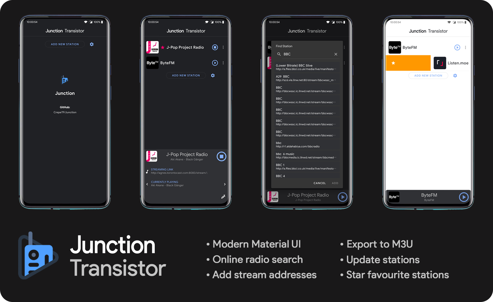

README
======
# Junction - a Transistor UI overhaul
**Based on Version 4.0.x of Transistor (codename "Andy Warhol") by [y20k](http://y20k.org)**

## App icon

## About
Junction is a radio app which was based on [Transistor](https://github.com/y20k/transistor), an app which has a minimalistic approach for listening to radio programs over the internet. Junction borrows the intuitive features of Transistor, while offering a modern and fresh approach to user interface. 

Transistor (and by logic, Junction) is free software. It is published under the MIT open source license. Want to help? Please check out the notes in CONTRIBUTE.md first.

## App screenshots

